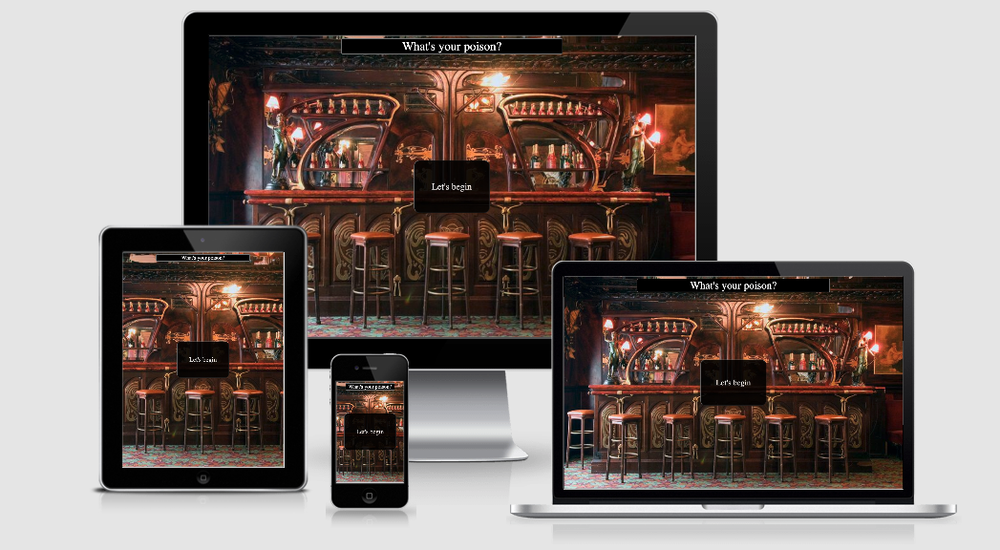

# MS2 "What's your poison" memory game

"What's your poison" is a version of a traditional memory game involving cards showing a range of cocktail images the user needs to find the matching pair.

## UX

### User Stories

As a user I would like to:
    * Have the game rules explained to me if needed.
    * Test my memory skills in a fun environment.
    * Have options to increase the difficulty of the game as I progress.
    * Record my time taken on the different levels to challenge myself to improve.

### Strategy

The goal is to build a simple to navigate site with a welcome Modal with game options that then guides the user through the site and back to the start when choosing to exit.

### Scope

For users there needs to be an explanation of how to play available. Additional record of best times to create a competitive environment and aim to improve.

### Structure

To keep navigation as self explanatory as possible the structure of the site should create a natural flow as follows.
    * Home page will use Modals with options to either start a new game with difficulty option, check the rules or check the high scores.
    * The game page will start after selection of difficulty and on completition pass/fail a modal will provide the option to input name if it's a high score pass,
     start again or exit back to home if a fail.
    * The high scores page will only have navigation to return to home page.

### Skeleton

Wire frames for page layouts and modals as follows:
* [Home Screen](https://github.com/David-A-Ray/MS2-Whats-your-poison-memory-game/blob/master/assets/docs/Home%20Screen.pdf)
* [Game Screen](https://github.com/David-A-Ray/MS2-Whats-your-poison-memory-game/blob/master/assets/docs/Game%20screen.pdf)
* [High score screen](https://github.com/David-A-Ray/MS2-Whats-your-poison-memory-game/blob/master/assets/docs/High%20Score%20page.pdf)

### Surface

The look and feel of the site is to feel like your in a vintage bar environment, dark classical colours with fun easy to identify cocktail images.

## Technologies

## Features

### Features left to implement

## Testing

### User stories Testing

## Deployment

## Credits

### media
    * Images and rights to use taken from Shutterstock.com

### Acknowledgments